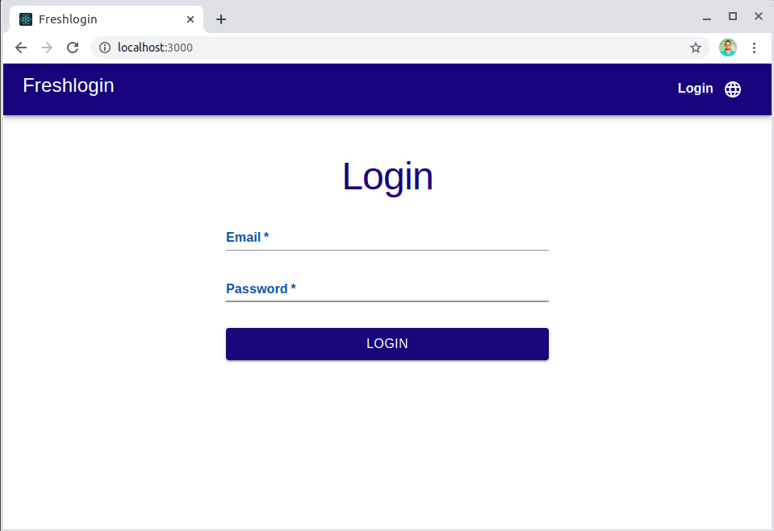

# Freshlogin App

## Important Packages:

- I have used [Material-UI](https://material-ui.com/) for user interface.
- I have user [Apollo Client](https://www.apollographql.com/docs/react/get-started/) for interactions with the graphql endpoint.
- I have used [react-router-dom](https://www.npmjs.com/package/react-router-dom) for handling routes.
- I have used [i18next](https://www.i18next.com/) for localization.
- I have used [jwt-decode](https://www.npmjs.com/package/jwt-decode) to extract the user id from the JWT token.

## Assumptions and Decisions:

- I have added some customization to the theme in `src/theme/index.ts` to show how I usually do that.
- I have used the latest **unstable**- version of the `createMuiTheme` to fix `findDOMNode is deprecated in StrictMode` warning.
- I have used Google translate for translating content into German.
- The French translation does not exist, so it will fall back to the default language.
- I have created `AuthContext` to share authentication status between components.
- I have created `NotificationsContext` to share notifications between components.
- The notifications component will continue showing notifications as long as there are remaining items in the context.

## TODO

- Add unit tests
- Support RTL languages like Arabic.

 

## Demo

 

 

- For testing purposes, please check the demo in https://freshlogin.netlify.app/
- The demo is hosted on [Netlify](https://www.netlify.com/) using a free account.
- The demo is connected to the graphql endpoint which was sent in the task.

   

## How to run the code on your machine:

 

- Clone the repository.
- In the project directory, you need to run `yarn` to install the packages.
- Rename `.env.example` to `.env` and add the graphql endpoint to it ex. `https://example/graphql`
- Then, you can run `yarn start` to run the app.
- Finally, Open http://localhost:3000 to view it in the browser.
      

#

   

# Getting Started with Create React App

 

This project was bootstrapped with [Create React App](https://github.com/facebook/create-react-app).

## Available Scripts

In the project directory, you can run:

### `yarn start`

Runs the app in the development mode.\
Open [http://localhost:3000](http://localhost:3000) to view it in the browser.

The page will reload if you make edits.\
You will also see any lint errors in the console.

### `yarn test`

Launches the test runner in the interactive watch mode.\
See the section about [running tests](https://facebook.github.io/create-react-app/docs/running-tests) for more information.

### `yarn build`

Builds the app for production to the `build` folder.\
It correctly bundles React in production mode and optimizes the build for the best performance.

The build is minified and the filenames include the hashes.\
Your app is ready to be deployed!

See the section about [deployment](https://facebook.github.io/create-react-app/docs/deployment) for more information.

### `yarn eject`

**Note: this is a one-way operation. Once you `eject`, you can’t go back!**

If you aren’t satisfied with the build tool and configuration choices, you can `eject` at any time. This command will remove the single build dependency from your project.

Instead, it will copy all the configuration files and the transitive dependencies (webpack, Babel, ESLint, etc) right into your project so you have full control over them. All of the commands except `eject` will still work, but they will point to the copied scripts so you can tweak them. At this point you’re on your own.

You don’t have to ever use `eject`. The curated feature set is suitable for small and middle deployments, and you shouldn’t feel obligated to use this feature. However we understand that this tool wouldn’t be useful if you couldn’t customize it when you are ready for it.

## Learn More

You can learn more in the [Create React App documentation](https://facebook.github.io/create-react-app/docs/getting-started).

To learn React, check out the [React documentation](https://reactjs.org/).
